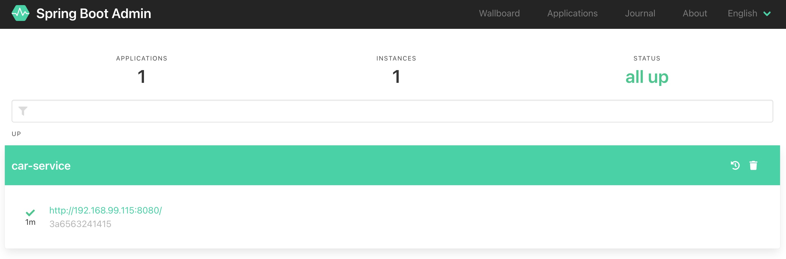
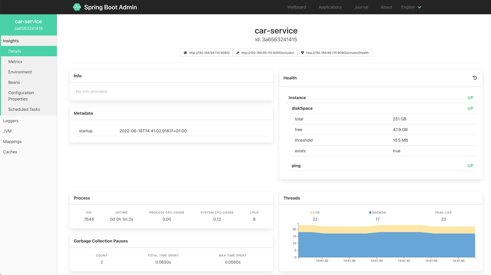

# "Spring boot admin Server" client
This is a demo of the Spring Boot Admin server client. \
Multiple client apps can be monitored from this single "admin server". \

This app will interact with the actuator_project.

### Spring Boot Admin UI



### Execution
```shell
# Change JDK to version 17
jdk17

# Clean, compile and execute the app
mvn clean compile spring-boot:run
```

### application.yaml
```yaml
spring:
  application:
    name: car-service
  boot:
    admin:
      client:
        url: http://localhost:8081/
        
management:
  endpoints:
    web:
      exposure:
        include: *
  endpoint:
    health:
      show-details: always
```